# Moo Assets Catalog

Generated: 2026-05-29 13:37:35

## Ace

**Default** - 

**Highland** - 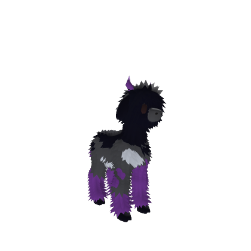

**Semi-Fluff** - 

**Tall** - 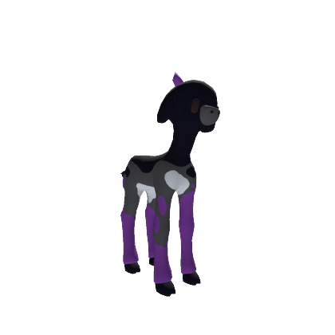

**Tall Semi-Fluff** - 

## Alien

**Unique** - 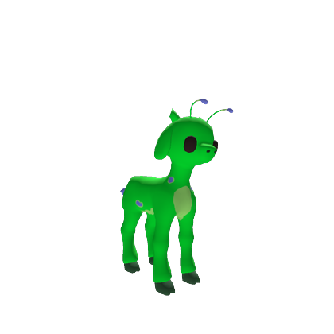

## Amethyst

**Default** - 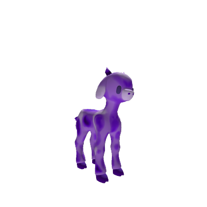

**Highland** - 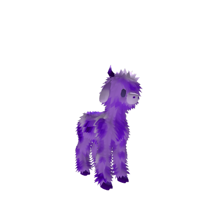

**Semi-Fluff** - 

**Tall** - 

**Tall Semi-Fluff** - 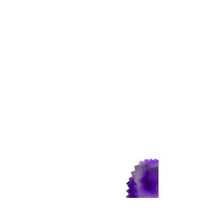

## Angel

**Unique** - 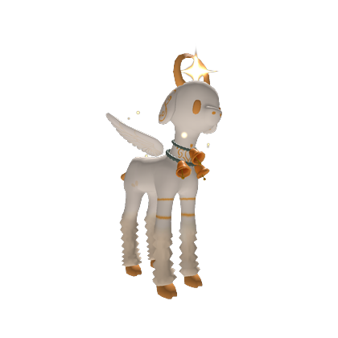

## Apple

**Default** - 

**Highland** - 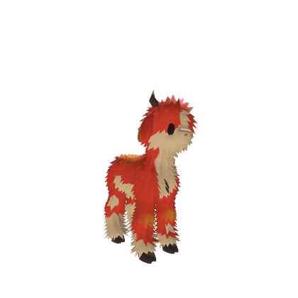

**Semi-Fluff** - 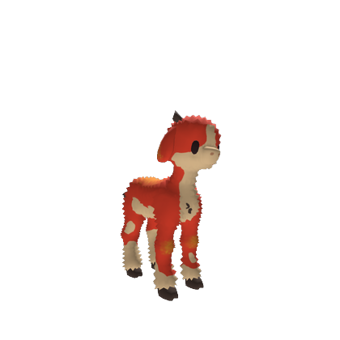

**Tall** - 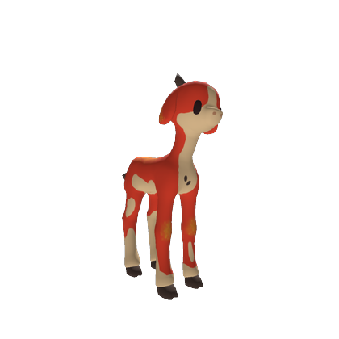

**Tall Semi-Fluff** - 

## Apple (Legacy)

**Default** - _Default.png)

**Highland** - _Highland.png)

**Semi-Fluff** - _Semi-Fluff.png)

**Tall** - _Tall.png)

**Tall Semi-Fluff** - _Tall Semi-Fluff.png)

## Aquamarine

**Default** - 

**Highland** - 

**Semi-Fluff** - 

**Tall** - 

**Tall Semi-Fluff** - 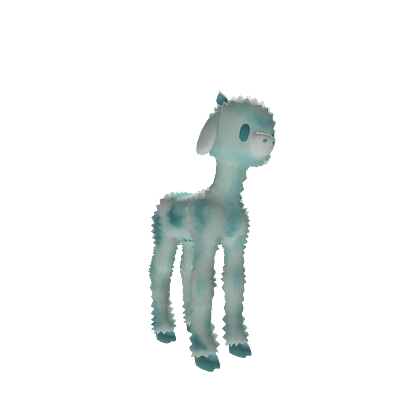

## Aro

**Default** - 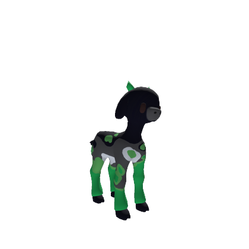

**Highland** - 

**Semi-Fluff** - 

**Tall** - 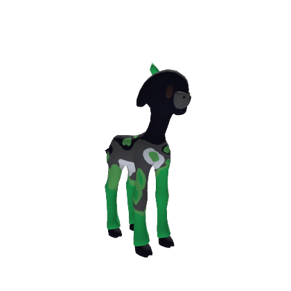

**Tall Semi-Fluff** - 

## Banana

**Default** - 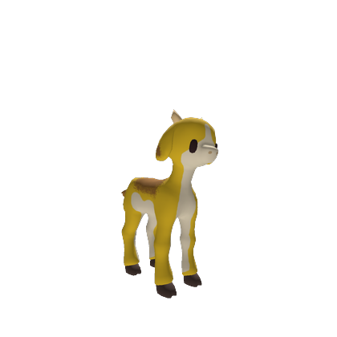

**Highland** - 

**Semi-Fluff** - 

**Tall** - 

**Tall Semi-Fluff** - 

## Banana (Legacy)

**Default** - _Default.png)

**Highland** - _Highland.png)

**Semi-Fluff** - _Semi-Fluff.png)

**Tall** - _Tall.png)

**Tall Semi-Fluff** - _Tall Semi-Fluff.png)

## Bee

**Default** - 

**Highland** - 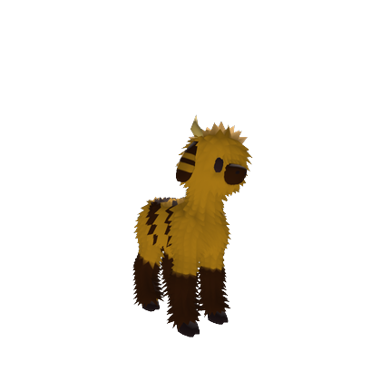

**Semi-Fluff** - 

**Tall** - 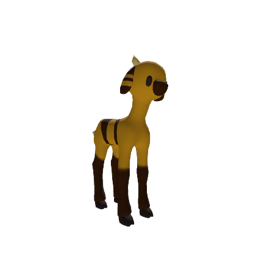

**Tall Semi-Fluff** - 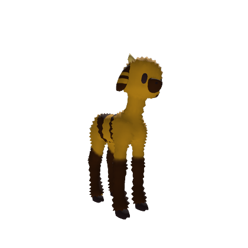

## Bi

**Default** - 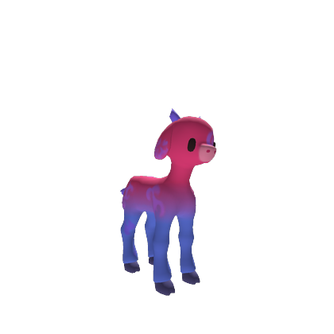

**Highland** - 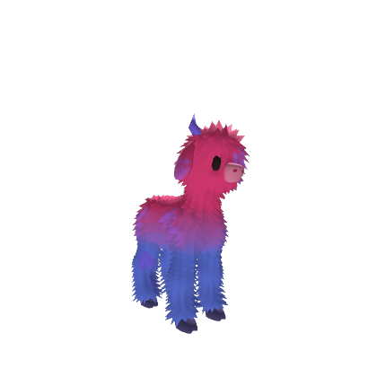

**Semi-Fluff** - 

**Tall** - 

**Tall Semi-Fluff** - 

## Blackberry

**Default** - 

**Highland** - 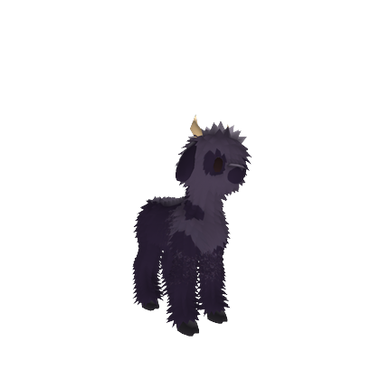

**Semi-Fluff** - 

**Tall** - 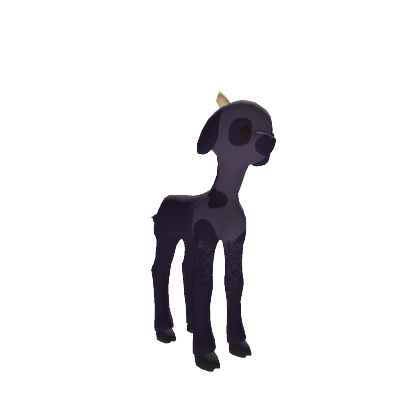

**Tall Semi-Fluff** - 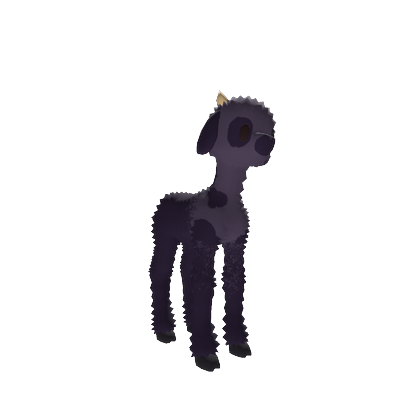

## Blackberry (Legacy)

**Default** - _Default.png)

**Highland** - _Highland.png)

**Semi-Fluff** - _Semi-Fluff.png)

**Tall** - _Tall.png)

**Tall Semi-Fluff** - _Tall Semi-Fluff.png)

## Blueberry

**Default** - 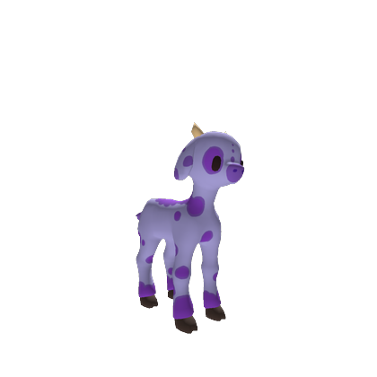

**Highland** - 

**Semi-Fluff** - 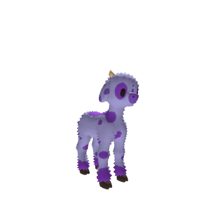

**Tall** - 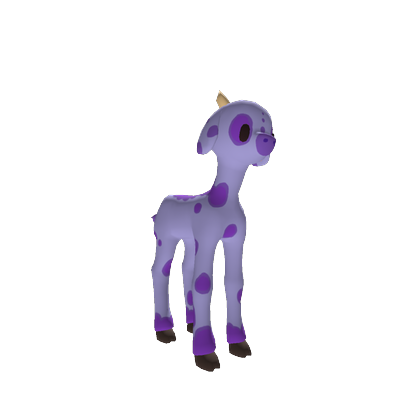

**Tall Semi-Fluff** - 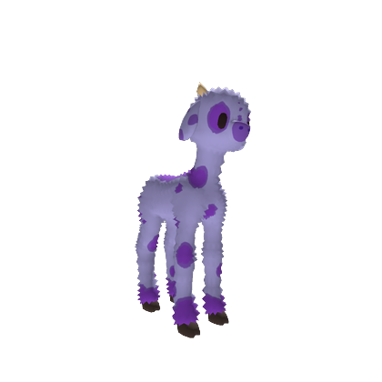

## Blueberry (Legacy)

**Default** - _Default.png)

**Highland** - _Highland.png)

**Semi-Fluff** - _Semi-Fluff.png)

**Tall** - _Tall.png)

**Tall Semi-Fluff** - _Tall Semi-Fluff.png)

## Brownie

**Default** - 

**Highland** - 

**Semi-Fluff** - 

**Tall** - 

**Tall Semi-Fluff** - 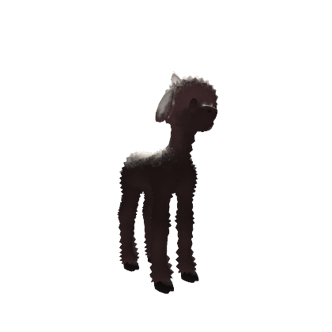

## Bubblegum

**Default** - 

**Highland** - 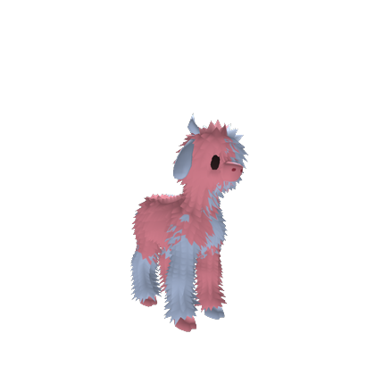

**Semi-Fluff** - 

**Tall** - 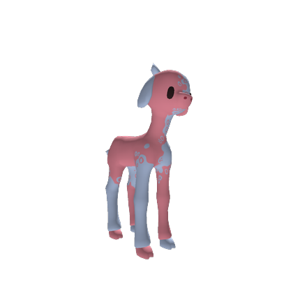

**Tall Semi-Fluff** - 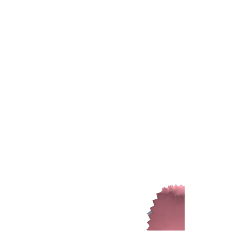

## Cashew

**Default** - 

**Highland** - 

**Semi-Fluff** - 

**Tall** - 

**Tall Semi-Fluff** - 

## Charcoal

**Default** - 

**Highland** - 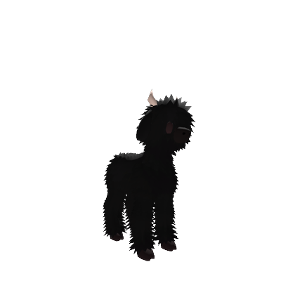

**Semi-Fluff** - 

**Tall** - 

**Tall Semi-Fluff** - 

## Chocolate

**Default** - 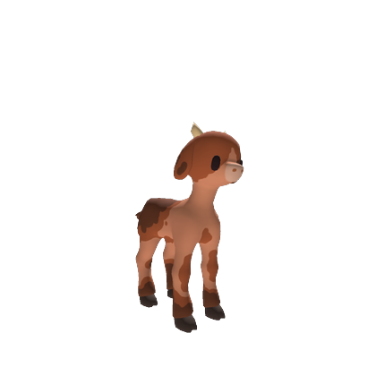

**Highland** - 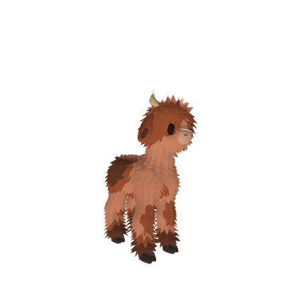

**Semi-Fluff** - 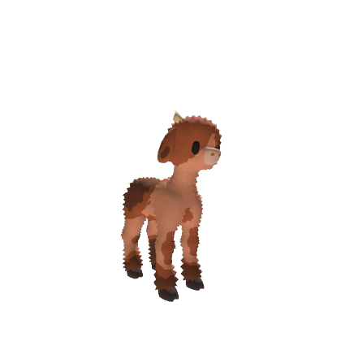

**Tall** - 

**Tall Semi-Fluff** - 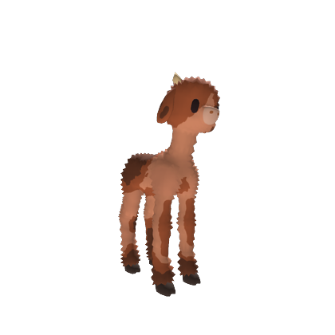

## Chocolate (Legacy)

**Default** - _Default.png)

**Highland** - _Highland.png)

**Semi-Fluff** - _Semi-Fluff.png)

**Tall** - _Tall.png)

**Tall Semi-Fluff** - _Tall Semi-Fluff.png)

## Citrine

**Default** - 

**Highland** - 

**Semi-Fluff** - 

**Tall** - 

**Tall Semi-Fluff** - 

## Cloud

**Default** - 

**Highland** - 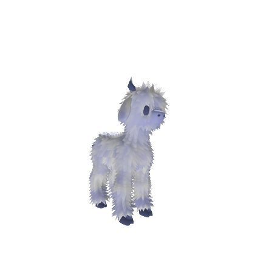

**Semi-Fluff** - 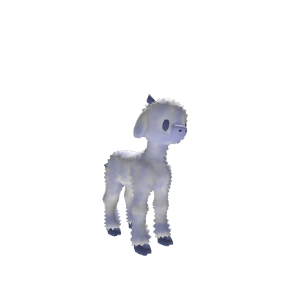

**Tall** - 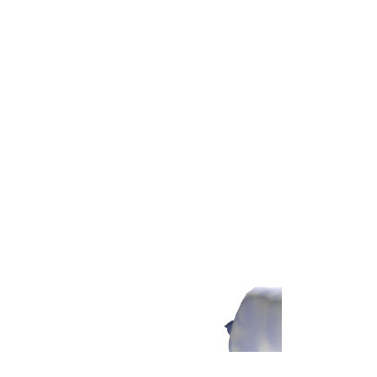

**Tall Semi-Fluff** - 

## Coffee

**Default** - 

**Highland** - 

**Semi-Fluff** - 

**Tall** - 

**Tall Semi-Fluff** - 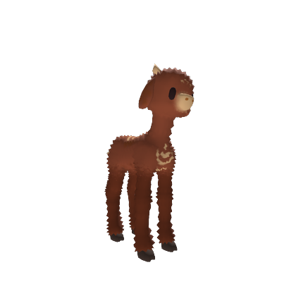

## Coffee (Legacy)

**Default** - _Default.png)

**Highland** - _Highland.png)

**Semi-Fluff** - _Semi-Fluff.png)

**Tall** - _Tall.png)

**Tall Semi-Fluff** - _Tall Semi-Fluff.png)

## Cookies & Cream

**Default** - 

**Highland** - 

**Semi-Fluff** - 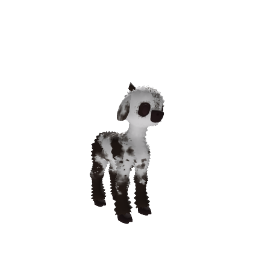

**Tall** - 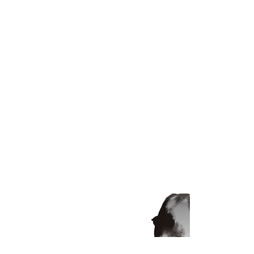

**Tall Semi-Fluff** - 

## Cotton

**Default** - 

**Highland** - 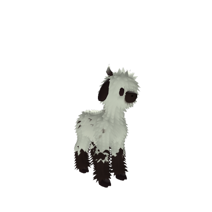

**Semi-Fluff** - 

**Tall** - 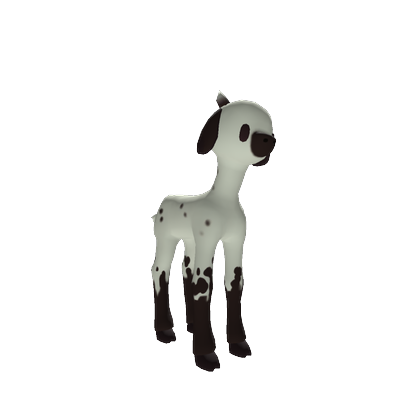

**Tall Semi-Fluff** - 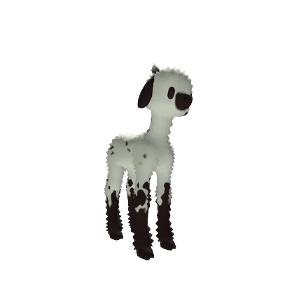

## Dandelion

**Default** - 

**Highland** - 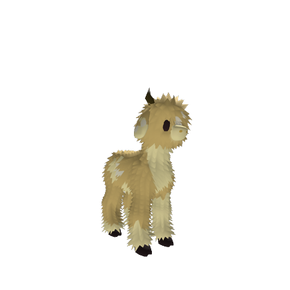

**Semi-Fluff** - 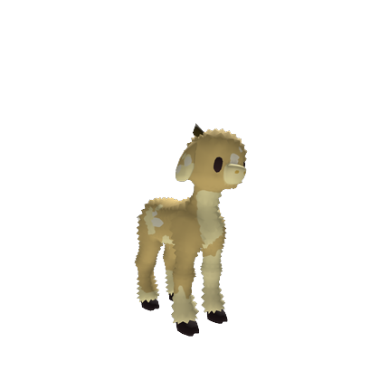

**Tall** - 

**Tall Semi-Fluff** - 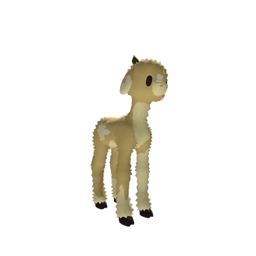

## Default

**Default** - 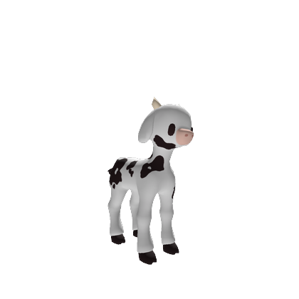

**Highland** - 

**Semi-Fluff** - 

**Tall** - 

**Tall Semi-Fluff** - 

## Dragonfruit

**Default** - 

**Highland** - 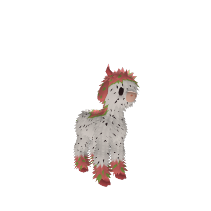

**Semi-Fluff** - 

**Tall** - 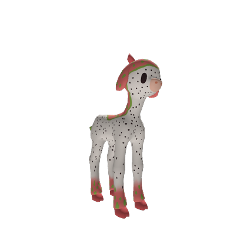

**Tall Semi-Fluff** - 

## Expired Milk

**Default** - 

**Highland** - 

**Semi-Fluff** - 

**Tall** - 

**Tall Semi-Fluff** - 

## Fake Cow

**Unique** - 

## Fear

**Unique** - 

## Fly Agaric

**Default** - 

**Highland** - 

**Semi-Fluff** - 

**Tall** - 

**Tall Semi-Fluff** - 

## Fly Agaric (Legacy)

**Default** - _Default.png)

**Highland** - _Highland.png)

**Semi-Fluff** - _Semi-Fluff.png)

**Tall** - _Tall.png)

**Tall Semi-Fluff** - _Tall Semi-Fluff.png)

## Gargoyle

**Default** - 

**Highland** - 

**Semi-Fluff** - 

**Tall** - 

**Tall Semi-Fluff** - 

## Gay

**Default** - 

**Highland** - 

**Semi-Fluff** - 

**Tall** - 

**Tall Semi-Fluff** - 

## Genderfluid

**Default** - 

**Highland** - 

**Semi-Fluff** - 

**Tall** - 

**Tall Semi-Fluff** - 

## Ghost

**Unique** - 

## Gingerbread

**Default** - 

**Highland** - 

**Semi-Fluff** - 

**Tall** - 

**Tall Semi-Fluff** - 

## Goldenberry

**Default** - 

**Highland** - 

**Semi-Fluff** - 

**Tall** - 

**Tall Semi-Fluff** - 

## Grass

**Default** - 

**Highland** - 

**Semi-Fluff** - 

**Tall** - 

**Tall Semi-Fluff** - 

## Grass (Legacy)

**Default** - _Default.png)

**Highland** - _Highland.png)

**Semi-Fluff** - _Semi-Fluff.png)

**Tall** - _Tall.png)

**Tall Semi-Fluff** - _Tall Semi-Fluff.png)

## Green Moss

**Default** - 

**Highland** - 

**Semi-Fluff** - 

**Tall** - 

**Tall Semi-Fluff** - 

## Heart

**Unique** - 

## Honey

**Default** - 

**Highland** - 

**Semi-Fluff** - 

**Tall** - 

**Tall Semi-Fluff** - 

## Hot Chocolate

**Default** - 

**Highland** - 

**Semi-Fluff** - 

**Tall** - 

**Tall Semi-Fluff** - 

## Ice

**Default** - 

**Highland** - 

**Semi-Fluff** - 

**Tall** - 

**Tall Semi-Fluff** - 

## Intersex

**Default** - 

**Highland** - 

**Semi-Fluff** - 

**Tall** - 

**Tall Semi-Fluff** - 

## Lemon

**Default** - 

**Highland** - 

**Semi-Fluff** - 

**Tall** - 

**Tall Semi-Fluff** - 

## Lesbian

**Default** - 

**Highland** - 

**Semi-Fluff** - 

**Tall** - 

**Tall Semi-Fluff** - 

## Light Moss

**Default** - 

**Highland** - 

**Semi-Fluff** - 

**Tall** - 

**Tall Semi-Fluff** - 

## Lychee

**Default** - 

**Highland** - 

**Semi-Fluff** - 

**Tall** - 

**Tall Semi-Fluff** - 

## Lychee (Legacy)

**Default** - _Default.png)

**Highland** - _Highland.png)

**Semi-Fluff** - _Semi-Fluff.png)

**Tall** - _Tall.png)

**Tall Semi-Fluff** - _Tall Semi-Fluff.png)

## Mango

**Default** - 

**Highland** - 

**Semi-Fluff** - 

**Tall** - 

**Tall Semi-Fluff** - 

## Milk

**Default** - 

**Highland** - 

**Semi-Fluff** - 

**Tall** - 

**Tall Semi-Fluff** - 

## Nonbinary

**Default** - 

**Highland** - 

**Semi-Fluff** - 

**Tall** - 

**Tall Semi-Fluff** - 

## Orange

**Default** - 

**Highland** - 

**Semi-Fluff** - 

**Tall** - 

**Tall Semi-Fluff** - 

## Pan

**Default** - 

**Highland** - 

**Semi-Fluff** - 

**Tall** - 

**Tall Semi-Fluff** - 

## Pear

**Default** - 

**Highland** - 

**Semi-Fluff** - 

**Tall** - 

**Tall Semi-Fluff** - 

## Peppermint

**Default** - 

**Highland** - 

**Semi-Fluff** - 

**Tall** - 

**Tall Semi-Fluff** - 

## Pinecone

**Default** - 

**Highland** - 

**Semi-Fluff** - 

**Tall** - 

**Tall Semi-Fluff** - 

## Pride

**Default** - 

**Highland** - 

**Semi-Fluff** - 

**Tall** - 

**Tall Semi-Fluff** - 

## Pudding

**Default** - 

**Highland** - 

**Semi-Fluff** - 

**Tall** - 

**Tall Semi-Fluff** - 

## Pumpkin

**Default** - 

**Highland** - 

**Semi-Fluff** - 

**Tall** - 

**Tall Semi-Fluff** - 

## Rainbow

**Default** - 

**Highland** - 

**Semi-Fluff** - 

**Tall** - 

**Tall Semi-Fluff** - 

## Rose

**Default** - 

**Highland** - 

**Semi-Fluff** - 

**Tall** - 

**Tall Semi-Fluff** - 

## Shadow

**Default** - 

**Highland** - 

**Semi-Fluff** - 

**Tall** - 

**Tall Semi-Fluff** - 

## Skeleton

**Unique** - 

## Snow

**Default** - 

**Highland** - 

**Semi-Fluff** - 

**Tall** - 

**Tall Semi-Fluff** - 

## Soap

**Default** - 

**Highland** - 

**Semi-Fluff** - 

**Tall** - 

**Tall Semi-Fluff** - 

## Soy Sauce

**Default** - 

**Highland** - 

**Semi-Fluff** - 

**Tall** - 

**Tall Semi-Fluff** - 

## Strawberry

**Default** - 

**Highland** - 

**Semi-Fluff** - 

**Tall** - 

**Tall Semi-Fluff** - 

## Strawberry (Legacy)

**Default** - _Default.png)

**Highland** - _Highland.png)

**Semi-Fluff** - _Semi-Fluff.png)

**Tall** - _Tall.png)

**Tall Semi-Fluff** - _Tall Semi-Fluff.png)

## TBH

**Unique** - 

## Tomato

**Default** - 

**Highland** - 

**Semi-Fluff** - 

**Tall** - 

**Tall Semi-Fluff** - 

## Trans

**Default** - 

**Highland** - 

**Semi-Fluff** - 

**Tall** - 

**Tall Semi-Fluff** - 

## Vanilla

**Default** - 

**Highland** - 

**Semi-Fluff** - 

**Tall** - 

**Tall Semi-Fluff** - 

## Zombie

**Unique** - 

